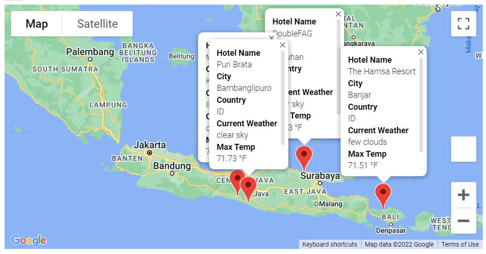

# World Weather Analysis
## Overview:
In this project we use API to extract weather data from OpenWeather and location data from Google Map.  We then use these data to make suggestion for vacation locations and possible itineray. 

## Details:
Using the citipy module, we randomly generated a list of over 700 cities around the world.  

With user inputed preferred temperature for their vacation locations, we created a map to vizulized the location of these cities.

We also build a sample vacation itinerary with visit to four of the possible vaction cities. 

