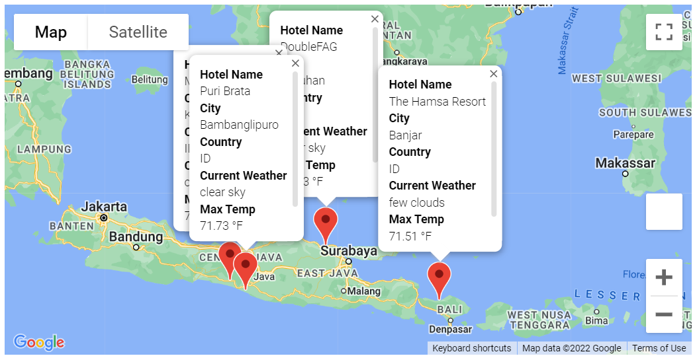

# World Weather Analysis
## Overview:
In this project, we use API to extract weather data from OpenWeather and location data from Google Map. We then use these data to make suggestions for vacation cities and possible itineraries.
 

## Details:
Using the citipy module, we randomly generated a list of over 700 cities around the world.  With users' input preferred temperatures for their vacation locations, we created a map to visualize where these possible vacation spots are around the world.

 
 
We also build a sample vacation itinerary with visit to four of the possible vaction cities. 

